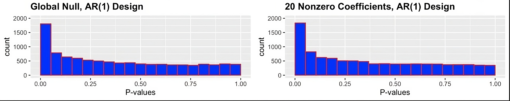
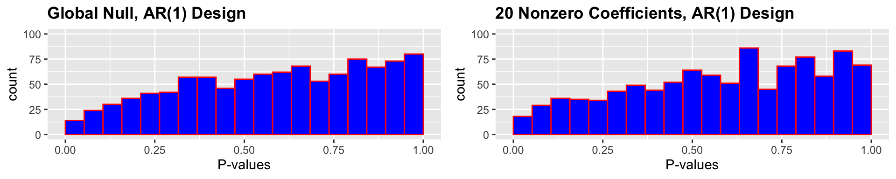

```{r setup, include=FALSE}
knitr::opts_chunk$set(
  echo = FALSE,
  eval = FALSE,
  warning = FALSE, 
  message = FALSE, 
  fig.width = 5, 
  fig.height = 4, 
  out.width = "50%", 
  fig.align = "center"
)
```

# Assignment 2

Link to our GitHub repository: <https://github.com/nprianikov/compstats>

## 1) Reproduce Figure 1 from [(Candès et al. 2018)](https://arxiv.org/abs/1610.02351).



```{r, echo=FALSE} 
# Helper functions to generate the data and responses

# Generate X as n AR(1) time-series of size p
generate_AR1 <- function(n, p) {
  X <- replicate(n, arima.sim(n=p, list(0.5)))
  return(t(X))
}

# Function to generate responses, fit a logistic regression model and return individual p-values
generate_p_values <- function(X, y, select = TRUE) {
  fit <- glm(y ~ X, family="binomial")
  
  p_values <- summary(fit)$coef[, "Pr(>|z|)"][-1] # remove intercept
  if (select) {
    print(p_values)
    p_values <- p_values[1] # Take p-values for beta_1 only  
    print(p_values)
  }
  return(p_values)
}
```

```{r, echo=FALSE}
library(tibble)

set.seed(101)

n <- 500
p <- 200

n_sim <- 10000

simulation <- function(n, p, prob = NULL) {
  X <- generate_AR1(n=n, p=p)
  if (is.null(prob)) {
    prob <- plogis(0.08*rowSums(X[, 2:22]))
  }
  y <- rbinom(n, 1, prob)  
  
  p_values <- generate_p_values(X=X, y=y)
  return(p_values)
}

df_plot <- tibble(
  p_values_1 = c(replicate(n_sim, simulation(n=n, p=p, prob=0.5))),
  p_values_2 = c(replicate(n_sim, simulation(n=n, p=p)))
)
```

```{r, echo=FALSE, fig.width=10, fig.height=2}
library(ggplot2)
library(cowplot)

# Create histograms for each set of p-values
histogram_1 <- ggplot(data=df_plot, aes(x=p_values_1)) + 
  geom_histogram(color="red", fill="blue", bins=20, boundary=0) +
  labs(x="P-values", y="count", title="Global Null, AR(1) Design") +
  theme(plot.title=element_text(hjust=0, face="bold")) +
  scale_x_continuous(limits=c(0, 1)) +
  scale_y_continuous(limits=c(0, 2000))

histogram_2 <- ggplot(data=df_plot, aes(x=p_values_2)) + 
  geom_histogram(color="red", fill="blue", bins=20, boundary=0) +
  labs(x="P-values", y="count", title="20 Nonzero Coefficients, AR(1) Design") +
  theme(plot.title=element_text(hjust=0, face="bold")) +
  scale_x_continuous(limits=c(0, 1)) +
  scale_y_continuous(limits=c(0, 2000))

# Arrange the plots side by side
combined_plots <- plot_grid(histogram_1, histogram_2, nrow=1, ncol=2, shareY=TRUE)

# Display the combined plots
print(combined_plots)
```

## 2) What is the problem that Figure 1 tries to illustrate?
The figure above illustrates the p-values for coefficient $\beta_1$ in two GLMs for two different systems. The figure shows, for each system, a histogram of the distribution of the $\beta_1$ p-value over $10,000$ replications of the experiment. The systems are given by the following functions:

(1) $Y | X_1, \ldots, X_p \sim \text{Bernoulli}(0.5)\\$

(2) $Y | X_1, \ldots, X_p \sim \text{Bernoulli}(\text{logit}(0.08(X_2 + \ldots + X_{21})))$

Where $(X_1,...,X_p)$ are themselves random variables generated by an $\text{AR}(1)$ time series with AR coefficient $0.5$, and $p = 200$. In other words, the results of the first simulation are completely independent from the $200$ values of $X_i$ while the second simulation is only dependent on $(X_2,...,X_{21})$. Neither system is influenced in any way by the predictor $X_1$ nor its coefficient $\beta_1$.

The figure shows that in both simulations, we see a significant amount of low $p$-values. In fact, for (1) we have $16.89 \%$ of $p$-values $\leq 0.05$, while for (2) it is $19.17\%$. In GLMs, the $p$-values of a coefficient indicate the importance of a coefficient to the model. Low $p$-values are linked to coefficients that are significant to the model, and are therefore also significantly different from $0$. This does not seem to be reflected in the figures, however, where we see that the $\beta_1$ coefficient is often having low $p$-values even though it has no impact at all on the underlying system that the model is trying to fit.

The problem can arise for multiple reasons in high-dimensional datasets, especially when the number of predictors is large relative to the amount of observations. One such reason is the multiple comparisons problem which occurs simply because so many hypotheses are being tested. In simulation (1) for example, where we have $200$ predictors with no relation to the outcome, we can still expect to identify $10$ important variables with a confidence of $95\%$. Another reason could be due to the model overfitting to the outcome variable. Even though predictors may not have any relationship with the outcome, they may still be able to help the model fit to this specific set of outcomes. This problem is especially common when we have a relatively small amount of observations.

To correct this problem, we will need to implement a method to decrease the false discovery rate such that we are less likely to label a predictor as being significant.

## 3) Propose a solution to address the problem.

The Conditional Randomization Test (CRT) from the [(Candès et al. 2018)](https://arxiv.org/abs/1610.02351) presents a solution to our problem. CRT generates a distribution for the test statistic under the null hypothesis by conditioning on the observed values of the response $Y$ and all covariates other than the one being tested. For each covariate $X{j}$, the CRT samples a new $X{j}$ from its conditional distribution given the other covariates, computes the test statistic for this new $X_{j}$ while $Y$ and the other covariates remain the same, and then compares this statistic to the one computed on the actual data.

However, we introduce two modifications to the original CRT procedure. Firstly, the original procedure requires us to know the conditional distribution of covariates. Since the exact distribution of the data is unknown in practice we follow the approach of [(Shaer et al. 2023)](https://arxiv.org/pdf/2210.00354.pdf), where conditional Gaussian distribution was used to sample the covariate $X_{j}$ conditional on all the other covariates. Parameters of the mean and the variance are therefore estimated from all the other covariates. The second difference is that for the test statistic $T_{j}$ we simply utilize absolute values of a coefficient fitted with Logistic regression without Lasso regularization. This is motivated by the fact that even with an extremely small penalty constant our experiments resulted in Lasso regularization to push the coefficients of the model to be too low which caused CRT to produce invalid $p$-values.

This process is repeated K times to generate an empirical distribution of the test statistic under the null hypothesis. The p-value is then calculated based on where the actual test statistic falls within this null distribution. By doing this, CRT accounts for the dependence between the covariates.

```{r, echo=FALSE}
library(MASS)

simulate_Xj_gaussian <- function(X, j) {
  n <- ncol(X)
  mu <- colMeans(X)
  sigma <- cov(X)

  mu_1 <- mu[j]
  mu_2 <- mu[-j]
  
  # Remove the j-th feature to compute the conditional
  sigma_11 <- sigma[j, j]
  sigma_22 <- sigma[-j, -j]
  sigma_12 <- sigma[j, -j]
  sigma_21 <- sigma[-j, j]

  # Calculate the conditional mean and variance for each sample
  sigma_inv <- ginv(sigma_22)
  mu_bar_list <- numeric(nrow(X))
  
  sigma_bar <- sigma_11 - sigma_12 %*% sigma_inv %*% sigma_21
  sampled_X_j <- numeric(nrow(X))
  
  for (i in 1:nrow(X)) {
    X_i <- X[i, -j]
    mu_bar <- mu_1 + sigma_12 %*% sigma_inv %*% (X_i - mu_2)
    sampled_X_j[i] <- rnorm(1, mean = mu_bar, sd = sqrt(sigma_bar))
  }
  return(sampled_X_j)
}

# Feature importance statistic function to test whether Xj and Y are conditionally independent.
# Using absolute value of an estimated coefficient
# Source paper uses abs. value of Lasso-estimated coefficient
compute_Tj <- function(X, y) {
  fit <- glm(y ~ X, family="binomial")
  coef <- coef(fit)
  return(abs(coef))
}

# Conditional Randomization Test for a specific j
conditional_randomization_test <- function(X, y, j, K = 20) {
  original_Tj <- compute_Tj(X=X, y=y)[j+1]
  greater_count <- 0
  
  for (k in 1:K) {
    # Create a new data matrix by simulating the jth column and keeping the remaining columns the same
    X_simulated <- X
    X_simulated[, j] <- simulate_Xj_gaussian(X=X, j=j)

    # Compute Tj for the simulated data
    simulated_Tj <- compute_Tj(X=X_simulated, y=y)[j+1]
    # Increment count if simulated Tj is greater than or equal to the original Tj
    if (simulated_Tj >= original_Tj) {
      greater_count <- greater_count + 1
    }
  }
  # Calculate p-value
  p_value <- (1 + greater_count) / (K + 1)
  return(p_value)
}
```

## 4) Show that your solution fixes the problem.



The histograms from CRT show that the distribution of p-values is more uniform. This uniform distribution is what we would expect if the null hypothesis is true. We can also see that there is no inflation of small p-values, which as explained in section 2 were identifying $\beta_1$ as significant.
The Conditional Randomization Test has corrected for this inflation by better modeling the null distribution.

In conclusion, CRT has provided valid p-values that are a more reliable indication of the true significance of the predictors.
```{r, echo=FALSE}
generate_responses_crt <- function(n, p, prob = NULL) {
  X <- generate_AR1(n=n, p=p)
  if (is.null(prob)) {
    prob <- plogis(0.08*rowSums(X[, 2:22]))
  }
  Y <- rbinom(n, 1, prob)
  
  # assuming that we want to be confident in showing that p-values are <= 0.05
  # set K = 20 (reciprocal of 0.05)
  # we are interested in running CRT for the first feature
  p_values <- conditional_randomization_test(X, Y, j=1, K=20)
  
  return(p_values)
}

fixed_p_values_1 <- replicate(1000, generate_responses_crt(n=n, p=p, prob=0.5))
fixed_p_values_2 <- replicate(1000, generate_responses_crt(n=n, p=p))
```

```{r, echo=FALSE, fig.width=10, fig.height=2}
df_crt <- tibble(
  p_values_1=fixed_p_values_1,
  p_values_2=fixed_p_values_2
)

# Create histograms for each set of p-values
histogram_1 <- ggplot(data=df_crt, aes(x=fixed_p_values_1)) + 
  geom_histogram(color="red", fill="blue", bins=20, boundary=0) +
  labs(x="P-values", y="count", title="Global Null, AR(1) Design") +
  theme(plot.title=element_text(hjust=0, face="bold")) +
  scale_x_continuous(limits=c(0, 1)) +
  scale_y_continuous(limits=c(0, 20))

histogram_2 <- ggplot(data=df_crt, aes(x=fixed_p_values_2)) + 
  geom_histogram(color="red", fill="blue", bins=20, boundary=0) +
  labs(x="P-values", y="count", title="20 Nonzero Coefficients, AR(1) Design") +
  theme(plot.title=element_text(hjust=0, face="bold")) +
  scale_x_continuous(limits=c(0, 1)) +
  scale_y_continuous(limits=c(0, 20))

# Arrange the plots side by side
combined_plots <- plot_grid(histogram_1, histogram_2, nrow=1, ncol=2, shareY=TRUE)

# Display the combined plots
print(combined_plots)
```

## 5) Find a real dataset and apply your method.

```{r, echo=FALSE}
library(readr)
library(dplyr)
library(ggplot2)
library(cowplot)

set.seed(111)

data <- read.csv('./data.csv')
data <- data[, !names(data) %in% c("Net.worth.Assets", "Current.Liability.to.Liability", "Current.Liability.to.Equity", "Net.Income.Flag")]
# data <- data[sample(nrow(data), 1000), ]

ncol(data)/nrow(data)
```

```{r, echo=FALSE}
# Get dependent and independent variables
y <- as.matrix(data[, 1])
X <- as.matrix(data[, -1])
X <- scale(X) # standardize features

# Compute p-values for all independent variables using both vanilla (none) and CRT approaches
df_data <- tibble(
  vanilla=generate_p_values(X=X, y=y, select=FALSE),
  crt=sapply(
    1:ncol(X), 
    function(j) conditional_randomization_test(X=X, y=y, j=j, K=20)
  )
)
```

```{r, echo=FALSE, fig.width=10, fig.height=2}
# Create histograms for each set of p-values
histogram_1 <- ggplot(data=df_data, aes(x=vanilla)) + 
  geom_histogram(color="red", fill="blue", bins=20, boundary=0) +
  labs(x="P-values", y="count", title="Vanilla") +
  theme(plot.title=element_text(hjust=0, face="bold")) +
  scale_x_continuous(limits=c(0, 1)) #+
  # scale_y_continuous(limits=c(0, 20))

histogram_2 <- ggplot(data=df_data, aes(x=crt)) + 
  geom_histogram(color="red", fill="blue", bins=20, boundary=0) +
  labs(x="P-values", y="count", title="CRT") +
  theme(plot.title=element_text(hjust=0, face="bold")) +
  scale_x_continuous(limits=c(0, 1)) #+
  #scale_y_continuous(limits=c(0, 20))

# Arrange the plots side by side
combined_plots <- plot_grid(histogram_1, histogram_2, nrow=1, ncol=2, shareY=TRUE)

# Display the combined plots
print(combined_plots)
```
